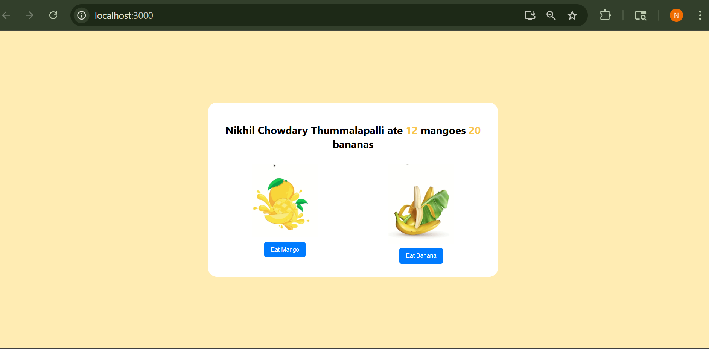

#Fruits Counter App

This is a simple and interactive React app where you can count how many mangoes and bananas were eaten. It's a beginner-friendly project to understand React `useState` and component rendering.

---

## 📸 Screenshot

> Make sure to place the screenshot image in the root folder and name it `screenshot.png`, or update the path accordingly.

---

## Features

- Count how many mangoes and bananas are eaten
- React functional components with `useState` hooks

---

##  Tech Stack

- React (Create React App)
---
